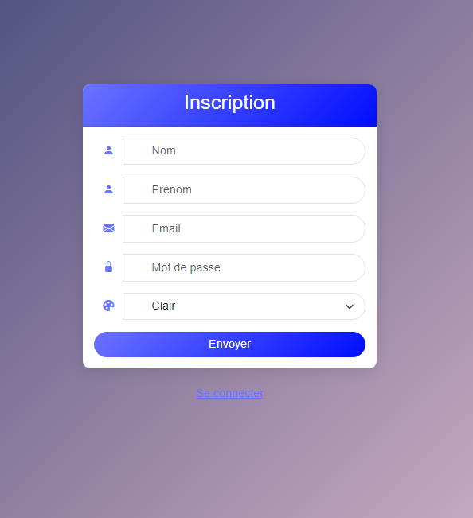

# Calendrier Spring Boot - README

## Introduction
Ce projet est une application de calendrier développée en utilisant Java, Maven, Spring Boot et Thymeleaf. L'application permet aux utilisateurs de s'inscrire et se connecter, de visualiser les jours du mois en cours, d'ajouter des GIFs avec une description, de dépenser des points pour ajouter des coûts aux jours du calendrier, et de réagir aux GIFs dans le calendrier.

## Fonctionnalités

1. **Inscription / Connexion**
    - Les utilisateurs peuvent créer un compte et se connecter pour accéder à leurs calendriers personnalisés.

2. **Affichage du Calendrier**
    - Voir les jours du mois en cours avec la possibilité de naviguer vers les semaines précédentes et suivantes.

3. **Ajout de GIFs**
    - Ajouter des GIFs à partir d'une URL distante avec une description.
    - Télécharger et ajouter des GIFs locaux avec une description.

4. **Gestion des Coûts**
    - Chaque jour du calendrier peut avoir un coût ajouté aléatoirement.
    - Ajouter un coût à un jour spécifique dépense des points du solde de l'utilisateur.

5. **Réactions aux GIFs**
    - Les utilisateurs peuvent réagir aux GIFs dans le calendrier.

## Installation

### Prérequis

- Java 17 ou supérieur

### Étapes d'installation

1. **Cloner le dépôt**

   ```bash
   git clone https://github.com/Bertrand2808/Calendrier
   cd Calendrier
   ```

2. **Compiler et exécuter l'application**

   ```bash
   mvn clean install
   mvn spring-boot:run
   ```

## Utilisation

### Inscription et Connexion

1. **Inscription**
    - Accédez à la page d'inscription via `/register` et remplissez le formulaire d'inscription.

2. **Connexion**
    - Accédez à la page de connexion via `/login` et connectez-vous avec vos identifiants.

### Gestion du Calendrier

1. **Affichage du Calendrier**
    - Une fois connecté, le calendrier du mois en cours s'affiche par défaut. Vous pouvez naviguer entre les semaines pour voir les jours précédents et suivants.

2. **Ajout de GIFs**
    - **Ajouter un GIF distant :** Cliquez sur `Ajouter un gif distant` et entrez l'URL du GIF et sa description.
    - **Ajouter un GIF local :** Cliquez sur `Ajouter un gif local`, téléchargez le GIF depuis votre ordinateur et ajoutez une description.

3. **Réagir aux GIFs**
    - Cliquez sur le bouton `Réagir` pour réagir aux GIFs dans le calendrier. A noter que vous pouvez aussi réagir "rapidement" en cliquant sur les emojis en face de chaque GIF.

## Diagrammes

### Diagramme de Classes


### Diagramme des controllers


### Diagramme des services


## Interfaces Utilisateur 

### Page de connexion 


### Page d'inscription


### Calendrier
- Thème clair

- Thème sombre


### Ajout de GIFs distants


### Ajout de GIFs locaux


### Réactions aux GIFs


Exemple si on post un gif avec l'utilisateur test et qu'on réagit avec un autre utilisateur : 


